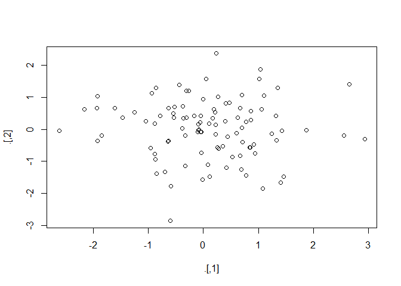
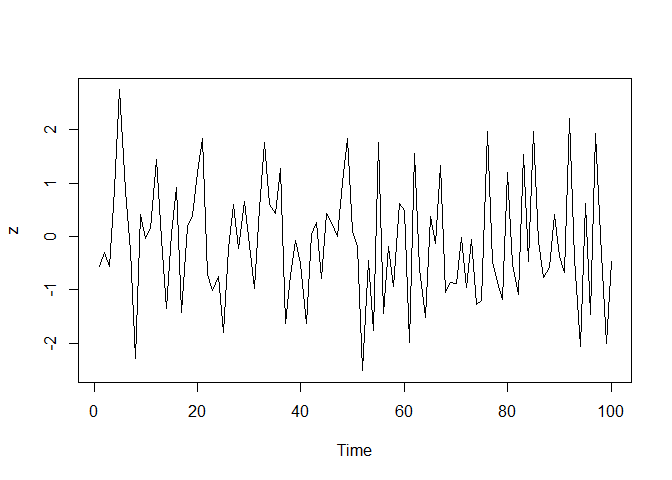
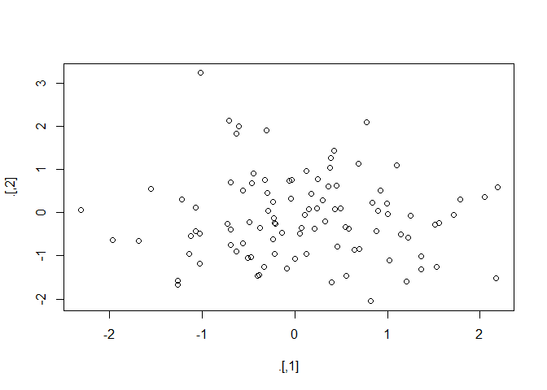
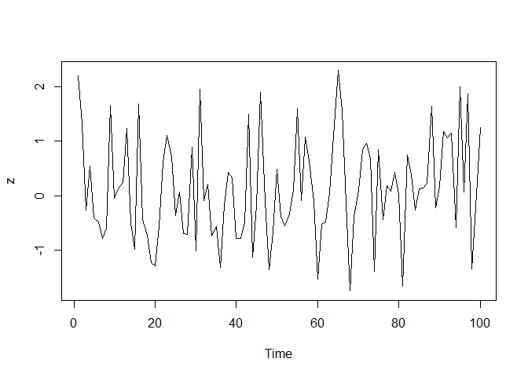

# DataCamp - Pipes in R Tutorial For Beginners
[Luka Ignjatović](https://github.com/LukaIgnjatovic)  

## Pipe Operator in R - Introduction

To understand what the pipe operator in R is and what you can do with it, it's necessary to consider the full picture, to learn the history behind it. Questions such as "where does this weird combination of symbols come from and why was it made like this?" might be on top of your mind. You'll discover the answers to these and more questions in this section.
Now, you can look at the history from three perspectives: from a mathematical point of view, from a holistic point of view of programming languages, and from the point of view of the R language itself. You'll cover all three in what follows!

### History of the Pipe Operator in R

#### Mathematical History

If you have two functions, let's say  and , you can chain these functions together by taking the output of one function and inserting it into the next. In short, "chaining" means that you pass an intermediate result onto the next function, but you'll see more about that later.

For example, you can say,  serves as an input for , while , of course, serves as input to .

If you would want to note this down, you will use the notation , which reads as "f follows g". Alternatively, you can visually represent this as:

<p align="center">
  
</p>

#### Pipe Operators in Other Programming Languages

As mentioned in the introduction to this section, this operator is not new in programming: in the Shell or Terminal, you can pass command from one to the next with the pipeline character `|`. Similarly, F# has a forward pipe operator, which will prove to be important later on! Lastly, it's also good to know that Haskell contains many piping operations that are derived from the Shell or Terminal.

#### Pipes in R

Now that you have seen some history of the pipe operator in other programming languages, it's time to focus on R. The history of this operator in R starts, according to this [fantastic blog post](http://adolfoalvarez.cl/plumbers-chains-and-famous-painters-the-history-of-the-pipe-operator-in-r/) written by Adolfo Álvarez, on January 17th, 2012, when an anonymous user asked the following question in [this Stack Overflow post](https://stackoverflow.com/questions/8896820/how-to-implement-fs-forward-pipe-operator-in-r):

> How can you implement F#'s forward pipe operator in R? The operator makes it possible to easily chain a sequence of calculations. For example, when you have an input data and want to call functions `foo` and `bar` in sequence, you can write data `|> foo |> bar`?

The answer came from Ben Bolker, professor at McMaster University, who replied:

> I don't know how well it would hold up to any real use, but this seems (?) to do what you want, at least for single-argument functions...  


```r
"%>%" <- function(x,f) do.call(f,list(x))
pi %>% sin
```

```
## [1] 1.224606e-16
```

```r
pi %>% sin %>% cos
```

```
## [1] 1
```

```r
cos(sin(pi))
```

```
## [1] 1
```

```
## 
## Attaching package: 'dplyr'
```

```
## The following objects are masked from 'package:stats':
## 
##     filter, lag
```

```
## The following objects are masked from 'package:base':
## 
##     intersect, setdiff, setequal, union
```

About nine months later, Hadley Wickham started the `dplyr` package on GitHub, but it wasn't until 2013 that the first pipe `%.%` appears in this package. As Adolfo Álvarez rightfully mentions in his blog post, the function was denominated `chain()`, which had the purpose to simplify the notation for the application of several functions to a single data frame in R.

The `%.%` pipe would not be around for long, as Stefan Bache proposed an alternative on the 29th of December 2013, that included the operator as you might now know it:


```r
iris %>%
  subset(Sepal.Length > 5) %>%
  aggregate(. ~ Species, ., mean)
```

```
##      Species Sepal.Length Sepal.Width Petal.Length Petal.Width
## 1     setosa     5.313636    3.713636     1.509091   0.2772727
## 2 versicolor     5.997872    2.804255     4.317021   1.3468085
## 3  virginica     6.622449    2.983673     5.573469   2.0326531
```

Bache continued to work with this pipe operation and at the end of 2013, the `magrittr` package came to being. In the meantime, Hadley Wickham continued to work on `dplyr` and in April 2014, the `%.%` operator got replaced with the one that you now know, `%>%`.

Later that year, Kun Ren published the `pipeR` package on GitHub, which incorporated a different pipe operator, `%>>%`, which was designed to add more flexibility to the piping process. However, it's safe to say that the `%>%` is now established in the R language, especially with the recent popularity of the Tidyverse.

### What Is It?

Knowing the history is one thing, but that still doesn't give you an idea of what F#'s forward pipe operator is nor what it actually does in R.

In F#, the pipe-forward operator `|>` is syntactic sugar for chained method calls. Or, stated more simply, it lets you pass an intermediate result onto the next function.

**Remember** that "chaining" means that you invoke multiple method calls. As each method returns an object, you can actually allow the calls to be chained together in a single statement, without needing variables to store the intermediate results.

In R, the pipe operator is, as you have already seen, `%>%`. If you're not familiar with F#, you can think of this operator as being similar to the `+` in a `ggplot2` statement. Its function is very similar to that one that you have seen of the F# operator: it takes the output of one statement and makes it the input of the next statement. When describing it, you can think of it as a "THEN".

Take, for example, following code chunk and read it aloud:


```r
iris %>%
  subset(iris$Sepal.Length > 5) %>%
  aggregate(. ~ Species, ., mean)
```

```
##      Species Sepal.Length Sepal.Width Petal.Length Petal.Width
## 1     setosa     5.313636    3.713636     1.509091   0.2772727
## 2 versicolor     5.997872    2.804255     4.317021   1.3468085
## 3  virginica     6.622449    2.983673     5.573469   2.0326531
```

You're right, the code chunk above will translate to something like "you take the Iris data, then you subset the data and then you aggregate the data".

This is one of the most powerful things about the Tidyverse. In fact, having a standardized chain of processing actions is called "a pipeline". Making pipelines for a data format is great, because you can apply that pipeline to incoming data that has the same formatting and have it output in a `ggplot2` friendly format, for example.

### Why Use It?

R is a functional language, which means that your code often contains a lot of parenthesis, `(` and `)`. When you have complex code, this often will mean that you will have to nest those parentheses together. This makes your R code hard to read and understand. Here's where `%>%` comes in to the rescue!

Take a look at the following example, which is a typical example of nested code:


```r
# Initialize `x`
x <- c(0.109, 0.359, 0.63, 0.996, 0.515, 0.142, 0.017, 0.829, 0.907)

# Compute the logarithm of `x`, return suitably lagged and iterated differences, 
# compute the exponential function and round the result
round(exp(diff(log(x))), 1)
```

```
## [1]  3.3  1.8  1.6  0.5  0.3  0.1 48.8  1.1
```

With the help of `%>%`, you can rewrite the above code as follows:


```r
# Import `magrittr`
library(magrittr)

# Perform the same computations on `x` as above
x %>% log(.) %>%
    diff(.) %>%
    exp(.) %>%
    round(1)
```

```
## [1]  3.3  1.8  1.6  0.5  0.3  0.1 48.8  1.1
```

Does this seem difficult to you? No worries! You'll learn more on how to go about this later on in this tutorial.

**Note** that you need to import the `magrittr` library to get the above code to work. That's because the pipe operator is, as you read above, part of the `magrittr` library and is, since 2014, also a part of `dplyr`. If you forget to import the library, you'll get an error like `Error in eval(expr, envir, enclos): could not find function "%>%"`.

Also note that it isn't a formal requirement to add the parentheses after `log`, `diff` and `exp`, but that, within the R community, some will use it to increase the readability of the code.

In short, here are four reasons why you should be using pipes in R:

* You'll structure the sequence of your data operations from left to right, as apposed to from inside and out;
* You'll avoid nested function calls;
* You'll minimize the need for local variables and function definitions; And
* You'll make it easy to add steps anywhere in the sequence of operations.

These reasons are taken from the `magrittr` [documentation itself](https://cran.r-project.org/web/packages/magrittr/magrittr.pdf). Implicitly, you see the arguments of readability and flexibility returning.

### Additional Pipes

Even though `%>%` is the (main) pipe operator of the `magrittr` package, there are a couple of other operators that you should know and that are part of the same package:

* The compound assignment operator `%<>%`;


```r
# Initialize `x` 
x <- rnorm(100)

# Update value of `x` and assign it to `x`
x %<>% abs %>% sort
```

* The tee operator `%T>%`;


```r
rnorm(200) %>%
matrix(ncol = 2) %T>%
plot %>% 
colSums
```

<!-- -->

```
## [1] -21.7055466  -0.2375088
```

**Note** that it's good to know for now that the above code chunk is actually a shortcut for:


```r
rnorm(200) %>%
matrix(ncol = 2) %T>%
{ plot(.); . } %>% 
colSums
```

<!-- -->

```
## [1] -11.696965  -7.773604
```

But you'll see more about that later on!  

* The exposition pipe operator `%$%`:


```r
data.frame(z = rnorm(100)) %$% 
  ts.plot(z)
```

<!-- -->

Of course, these three operators work slightly differently than the main `%>%` operator. You'll see more about their functionalities and their usage later on in this tutorial!

## How to Use Pipes in R

Now that you know how the `%>%` operator originated, what it actually is and why you should use it, it's time for you to discover how you can actually use it to your advantage. You will see that there are quite some ways in which you can use it!

### Basic Piping

Before you go into the more advanced usages of the operator, it's good to first take a look at the most basic examples that use the operator. In essence, you'll see that there are 3 rules that you can follow when you're first starting out:

* `f(x)` can be rewritten as `x %>% f`

In short, this means that functions that take one argument, `function(argument)`, can be rewritten as follows: `argument %>% function()`. Take a look at the following, more practical example to understand how these two are equivalent:


```r
# Compute the logarithm of `x` 
log(x)
```

```
##   [1] -5.67091341 -4.29434330 -3.59551628 -3.28647286 -3.23772828
##   [6] -2.99123401 -2.80944495 -2.75174486 -2.71972960 -2.63899832
##  [11] -2.12572084 -2.02327660 -1.82142970 -1.70411989 -1.68684545
##  [16] -1.56947435 -1.55531851 -1.49083968 -1.38704644 -0.98853249
##  [21] -0.97890736 -0.94252693 -0.93914041 -0.93315959 -0.92597881
##  [26] -0.90390555 -0.85859775 -0.80750801 -0.78295985 -0.75804293
##  [31] -0.72286668 -0.68005168 -0.65810266 -0.64405086 -0.61759593
##  [36] -0.57613727 -0.57355596 -0.57184605 -0.54794604 -0.53720405
##  [41] -0.53540961 -0.50412106 -0.48566106 -0.48126138 -0.45779666
##  [46] -0.42063573 -0.41564411 -0.41217124 -0.40135862 -0.36598533
##  [51] -0.35171234 -0.35015966 -0.34478232 -0.31546417 -0.24714373
##  [56] -0.24218827 -0.23733028 -0.23657473 -0.19037041 -0.18411445
##  [61] -0.18122836 -0.17552319 -0.17306282 -0.12712729 -0.11359669
##  [66] -0.04130426 -0.02040768  0.04322398  0.11133104  0.11939020
##  [71]  0.14059185  0.16503868  0.19451647  0.20759665  0.22246094
##  [76]  0.26591399  0.28408191  0.32027408  0.35057700  0.35076219
##  [81]  0.37277366  0.38138497  0.39531719  0.41051293  0.41282113
##  [86]  0.42979756  0.46752972  0.47151829  0.48797874  0.59390090
##  [91]  0.59636148  0.62401781  0.62494512  0.65692630  0.74762590
##  [96]  0.78214308  0.81160478  0.88148948  0.94707371  1.05872529
```

```r
# Compute the logarithm of `x` 
x %>% log()
```

```
##   [1] -5.67091341 -4.29434330 -3.59551628 -3.28647286 -3.23772828
##   [6] -2.99123401 -2.80944495 -2.75174486 -2.71972960 -2.63899832
##  [11] -2.12572084 -2.02327660 -1.82142970 -1.70411989 -1.68684545
##  [16] -1.56947435 -1.55531851 -1.49083968 -1.38704644 -0.98853249
##  [21] -0.97890736 -0.94252693 -0.93914041 -0.93315959 -0.92597881
##  [26] -0.90390555 -0.85859775 -0.80750801 -0.78295985 -0.75804293
##  [31] -0.72286668 -0.68005168 -0.65810266 -0.64405086 -0.61759593
##  [36] -0.57613727 -0.57355596 -0.57184605 -0.54794604 -0.53720405
##  [41] -0.53540961 -0.50412106 -0.48566106 -0.48126138 -0.45779666
##  [46] -0.42063573 -0.41564411 -0.41217124 -0.40135862 -0.36598533
##  [51] -0.35171234 -0.35015966 -0.34478232 -0.31546417 -0.24714373
##  [56] -0.24218827 -0.23733028 -0.23657473 -0.19037041 -0.18411445
##  [61] -0.18122836 -0.17552319 -0.17306282 -0.12712729 -0.11359669
##  [66] -0.04130426 -0.02040768  0.04322398  0.11133104  0.11939020
##  [71]  0.14059185  0.16503868  0.19451647  0.20759665  0.22246094
##  [76]  0.26591399  0.28408191  0.32027408  0.35057700  0.35076219
##  [81]  0.37277366  0.38138497  0.39531719  0.41051293  0.41282113
##  [86]  0.42979756  0.46752972  0.47151829  0.48797874  0.59390090
##  [91]  0.59636148  0.62401781  0.62494512  0.65692630  0.74762590
##  [96]  0.78214308  0.81160478  0.88148948  0.94707371  1.05872529
```

* `f(x, y)` can be rewritten as `x %>% f(y)`

Of course, there are a lot of functions that don't just take one argument, but multiple. This is the case here: you see that the function takes two arguments, `x` and `y`. Similar to what you have seen in the first example, you can rewrite the function by following the structure `argument1 %>% function(argument2)`, where `argument1` is the `magrittr` placeholder and `argument2` the function call.
This all seems quite theoretical. Let's take a look at a more practical example:


```r
# Round pi
round(pi, 6)
```

```
## [1] 3.141593
```

```r
# Round pi 
pi %>% round(6)
```

```
## [1] 3.141593
```

* `x %>% f %>% g %>% h` can be rewritten as `h(g(f(x)))`

This might seem complex, but it isn't quite like that when you look at a real-life R example:


```r
# Import `babynames` data
library(babynames)

# Load the data
data(babynames)

# Count how many young boys with the name "Taylor" are born
sum(select(filter(babynames, sex == "M", name == "Taylor"), n))
```

```
## [1] 107966
```

```r
# Do the same but now with `%>%`
babynames %>% filter(sex == "M", name == "Taylor") %>%
              select(n) %>%
              sum
```

```
## [1] 107966
```

**Note** how you work from the inside out when you rewrite the nested code: you first put in the `babynames`, then you use `%>%` to first `filter()` the data. After that, you'll select `n` and lastly, you'll `sum()` everything.

**Remember** also that you already saw another example of such a nested code that was converted to more readable code in the beginning of this tutorial, where you used the `log()`, `diff()`, `exp()` and `round()` functions to perform calculations on `x`.

#### Functions that Use the Current Environment

Unfortunately, there are some exceptions to the more general rules that were outlined in the previous section. Let's take a look at some of them here.

Consider this example, where you use the `assign()` function to assign the value `10` to the variable `x`:


```r
# Assign `10` to `x`
assign("x", 10)

# Assign `100` to `x` 
"x" %>% assign(100)

# Return `x`
x
```

```
## [1] 10
```

You see that the second call with the `assign()` function, in combination with the pipe, doesn't work properly. The value of `x` is not updated.

Why is this?

That's because the function assigns the new value `100` to a temporary environment used by `%>%`. So, if you want to use `assign()` with the pipe, you must be explicit about the environment:


```r
# Define your environment
env <- environment()

# Add the environment to `assign()`
"x" %>% assign(100, envir = env)

# Return `x`
x
```

```
## [1] 100
```

#### Functions with Lazy Evalution

Arguments within functions are only computed when the function uses them in R. This means that no arguments are computed before you call your function! That means also that the pipe computes each element of the function in turn.

One place that this is a problem is `tryCatch()`, which lets you capture and handle errors, like in this example:


```r
tryCatch(stop("!"), error = function(e) "An error")
```

```
## [1] "An error"
```

```r
stop("!") %>% 
  tryCatch(error = function(e) "An error")
```

You'll see that the nested way of writing down this line of code works perfectly, while the piped alternative returns an error. Other functions with the same behavior are `try()`, `suppressMessages()`, and `suppressWarnings()` in base R.

### Argument Placeholder

There are also instances where you can use the pipe operator as an argument placeholder. Take a look at the following examples:

* `f(x, y)` can be rewritten as `y %>% f(x, .)`

In some cases, you won't want the value or the `magrittr` placeholder to the function call at the first position, which has been the case in every example that you have seen up until now. Reconsider this line of code:


```r
pi %>% round(6)
```

```
## [1] 3.141593
```

If you would rewrite this line of code, `pi` would be the first argument in your `round()` function. But what if you would want to replace the second, third, ... argument and use that one as the `magrittr` placeholder to your function call?

Take a look at this example, where the value is actually at the third position in the function call:


```r
"Ceci n'est pas une pipe" %>% gsub("une", "un", .)
```

```
## [1] "Ceci n'est pas un pipe"
```

* `f(y, z = x)` can be rewritten as `x %>% f(y, z = .)`

Likewise, you might want to make the value of a specific argument within your function call the `magrittr` placeholder. Consider the following line of code:


```r
6 %>% round(pi, digits = .)
```

```
## [1] 3.141593
```

### Re-using the Placeholder for Attributes

It is straight-forward to use the placeholder several times in a right-hand side expression. However, when the placeholder only appears in a nested expressions `magrittr` will still apply the first-argument rule. The reason is that in most cases this results more clean code.

Here are some general "rules" that you can take into account when you're working with argument placeholders in nested function calls:

* `f(x, y = nrow(x), z = ncol(x))` can be rewritten as `x %>% f(y = nrow(.), z = ncol(.))`


```r
# Initialize a matrix `ma` 
ma <- matrix(1:12, 3, 4)

# Return the maximum of the values inputted
max(ma, nrow(ma), ncol(ma))
```

```
## [1] 12
```

```r
# Return the maximum of the values inputted
ma %>% max(nrow(ma), ncol(ma))
```

```
## [1] 12
```

The behavior can be overruled by enclosing the right-hand side in braces:

* `f(y = nrow(x), z = ncol(x))` can be rewritten as `x %>% {f(y = nrow(.), z = ncol(.))}`


```r
# Only return the maximum of the `nrow(ma)` and `ncol(ma)` input values
ma %>% {max(nrow(ma), ncol(ma))}
```

```
## [1] 4
```

To conclude, also take a look at the following example, where you could possibly want to adjust the workings of the argument placeholder in the nested function call:


```r
# The function that you want to rewrite
paste(1:5, letters[1:5])
```

```
## [1] "1 a" "2 b" "3 c" "4 d" "5 e"
```

```r
# The nested function call with dot placeholder
1:5 %>%
  paste(., letters[.])
```

```
## [1] "1 a" "2 b" "3 c" "4 d" "5 e"
```

You see that if the placeholder is only used in a nested function call, the `magrittr` placeholder will also be placed as the first argument! If you want to avoid this from happening, you can use the curly brackets `{` and `}`:


```r
# The nested function call with dot placeholder and curly brackets
1:5 %>% {
  paste(letters[.])
}
```

```
## [1] "a" "b" "c" "d" "e"
```

```r
# Rewrite the above function call 
paste(letters[1:5])
```

```
## [1] "a" "b" "c" "d" "e"
```

### Building Unary Functions

Unary functions are functions that take one argument. Any pipeline that you might make that consists of a dot `.`, followed by functions and that is chained together with `%>%` can be used later if you want to apply it to values. Take a look at the following example of such a pipeline:


```r
. %>% cos %>% sin
```

```
## Functional sequence with the following components:
## 
##  1. cos(.)
##  2. sin(.)
## 
## Use 'functions' to extract the individual functions.
```

This pipeline would take some input, after which both the `cos()` and `sin()` fuctions would be applied to it.

But you're not there yet! If you want this pipeline to do exactly that which you have just read, you need to assign it first to a variable `f`, for example. After that, you can re-use it later to do the operations that are contained within the pipeline on other values.


```r
# Unary function
f <- . %>% cos %>% sin 

f
```

```
## Functional sequence with the following components:
## 
##  1. cos(.)
##  2. sin(.)
## 
## Use 'functions' to extract the individual functions.
```

```r
structure(function (value) 
freduce(value, `_function_list`), class = c("fseq", "function"))
```

```
## Functional sequence with the following components:
## 
##  1. NULL
##  0. NULL
## 
## Use 'functions' to extract the individual functions.
```

Remember also that you could put parentheses after the `cos()` and `sin()` functions in the line of code if you want to improve readability. Consider the same example with parentheses: `. %>% cos() %>% sin()`.

You see, building functions in `magrittr` very similar to building functions with base R! If you're not sure how similar they actually are, check out the line above and compare it with the next line of code; Both lines have the same result!


```r
# is equivalent to 
f <- function(.) sin(cos(.))

f
```

```
## function(.) sin(cos(.))
```


```r
function (.) 
sin(cos(.))
```

```
## function (.) 
## sin(cos(.))
```

### Compound Assignment Pipe Operations

There are situations where you want to overwrite the value of the left-hand side, just like in the example right below. Intuitively, you will use the assignment operator `<-` to do this.


```r
# Load in the Iris data
iris <- read.csv(url("http://archive.ics.uci.edu/ml/machine-learning-databases/iris/iris.data"), header = FALSE)

# Add column names to the Iris data
names(iris) <- c("Sepal.Length", "Sepal.Width", "Petal.Length", "Petal.Width", "Species")

# Compute the square root of `iris$Sepal.Length` and assign it to the variable
iris$Sepal.Length <- 
  iris$Sepal.Length %>%
  sqrt()
```

However, there is a compound assignment pipe operator, which allows you to use a shorthand notation to assign the result of your pipeline immediately to the left-hand side:


```r
# Compute the square root of `iris$Sepal.Length` and assign it to the variable
iris$Sepal.Length %<>% sqrt

# Return `Sepal.Length`
iris$Sepal.Length
```

```
##   [1] 1.502770 1.487815 1.472395 1.464500 1.495349 1.524398 1.464500
##   [8] 1.495349 1.448315 1.487815 1.524398 1.480166 1.480166 1.440015
##  [15] 1.551876 1.545143 1.524398 1.502770 1.545143 1.502770 1.524398
##  [22] 1.502770 1.464500 1.502770 1.480166 1.495349 1.495349 1.510083
##  [29] 1.510083 1.472395 1.480166 1.524398 1.510083 1.531407 1.487815
##  [36] 1.495349 1.531407 1.487815 1.448315 1.502770 1.495349 1.456475
##  [43] 1.448315 1.495349 1.502770 1.480166 1.502770 1.464500 1.517291
##  [50] 1.495349 1.626577 1.590541 1.620736 1.531407 1.596718 1.545143
##  [57] 1.584292 1.487815 1.602825 1.510083 1.495349 1.558522 1.565085
##  [64] 1.571565 1.538321 1.608862 1.538321 1.551876 1.577967 1.538321
##  [71] 1.558522 1.571565 1.584292 1.571565 1.590541 1.602825 1.614832
##  [78] 1.608862 1.565085 1.545143 1.531407 1.531407 1.551876 1.565085
##  [85] 1.524398 1.565085 1.608862 1.584292 1.538321 1.531407 1.531407
##  [92] 1.571565 1.551876 1.495349 1.538321 1.545143 1.545143 1.577967
##  [99] 1.502770 1.545143 1.584292 1.551876 1.632355 1.584292 1.596718
## [106] 1.660364 1.487815 1.643731 1.608862 1.638073 1.596718 1.590541
## [113] 1.614832 1.545143 1.551876 1.590541 1.596718 1.665799 1.665799
## [120] 1.565085 1.620736 1.538321 1.665799 1.584292 1.608862 1.638073
## [127] 1.577967 1.571565 1.590541 1.638073 1.649331 1.676512 1.590541
## [134] 1.584292 1.571565 1.665799 1.584292 1.590541 1.565085 1.620736
## [141] 1.608862 1.620736 1.551876 1.614832 1.608862 1.608862 1.584292
## [148] 1.596718 1.577967 1.558522
```

**Note** that the compound assignment operator `%<>%` needs to be the first pipe operator in the chain for this to work. This is completely in line with what you just read about the operator being a shorthand notation for a longer notation with repetition, where you use the regular `<-` assignment operator.

As a result, this operator will assign a result of a pipeline rather than returning it.

### Tee Operations with The Tee Operator

The tee operator works exactly like `%>%`, but it returns the left-hand side value rather than the potential result of the right-hand side operations.

This means that the tee operator can come in handy in situations where you have included functions that are used for their side effect, such as plotting with `plot()` or printing to a file.

In other words, functions like `plot()` typically don't return anything. That means that, after calling `plot()`, for example, your pipeline would end. However, in the following example, the tee operator `%T>%` allows you to continue your pipeline even after you have used `plot()`:


```r
set.seed(123)
rnorm(200) %>%
matrix(ncol = 2) %T>%
plot %>% 
colSums
```

<!-- -->

```
## [1]   9.040591 -10.754680
```

### Exposing Data Variables with the Exposition Operator

When you're working with R, you'll find that many functions take a `data` argument. Consider, for example, the `lm()` function or the `with()` function. These functions are useful in a pipeline where your data is first processed and then passed into the function.

For functions that don't have a `data` argument, such as the `cor()` function, it's still handy if you can expose the variables in the data. That's where the `%$%` operator comes in. Consider the following example:


```r
iris %>%
  subset(Sepal.Length > mean(Sepal.Length)) %$%
  cor(Sepal.Length, Sepal.Width)
```

```
## [1] 0.3366969
```

With the help of `%$%` you make sure that `Sepal.Length` and `Sepal.Width` are exposed to `cor()`. Likewise, you see that the data in the `data.frame()` function is passed to the `ts.plot()` to plot several time series on a common plot:


```r
data.frame(z = rnorm(100)) %$%
  ts.plot(z)
```

<!-- -->

## dplyr and magrittr

In the introduction to this tutorial, you already learned that the development of `dplyr` and `magrittr` occurred around the same time, namely, around 2013-2014. And, as you have read, the `magrittr` package is also part of the Tidyverse.

In this section, you will discover how exciting it can be when you combine both packages in your R code.

For those of you who are new to the `dplyr` package, you should know that this R package was built around five verbs, namely, "select", "filter", "arrange", "mutate" and "summarize". If you have already manipulated data for some data science project, you will know that these verbs make up the majority of the data manipulation tasks that you generally need to perform on your data.

Take an example of some traditional code that makes use of these `dplyr` functions:


```r
library(hflights)

grouped_flights <- group_by(hflights, Year, Month, DayofMonth)
flights_data <- select(grouped_flights, Year:DayofMonth, ArrDelay, DepDelay)
summarized_flights <- summarise(flights_data, 
                arr = mean(ArrDelay, na.rm = TRUE), 
                dep = mean(DepDelay, na.rm = TRUE))
final_result <- filter(summarized_flights, arr > 30 | dep > 30)

final_result
```

```
## Source: local data frame [14 x 5]
## Groups: Year, Month [10]
## 
##     Year Month DayofMonth      arr      dep
##    <int> <int>      <int>    <dbl>    <dbl>
## 1   2011     2          4 44.08088 47.17216
## 2   2011     3          3 35.12898 38.20064
## 3   2011     3         14 46.63830 36.13657
## 4   2011     4          4 38.71651 27.94915
## 5   2011     4         25 37.79845 22.25574
## 6   2011     5         12 69.52046 64.52039
## 7   2011     5         20 37.02857 26.55090
## 8   2011     6         22 65.51852 62.30979
## 9   2011     7         29 29.55755 31.86944
## 10  2011     9         29 39.19649 32.49528
## 11  2011    10          9 61.90172 59.52586
## 12  2011    11         15 43.68134 39.23333
## 13  2011    12         29 26.30096 30.78855
## 14  2011    12         31 46.48465 54.17137
```

When you look at this example, you immediately understand why `dplyr` and `magrittr` are able to work so well together:


```r
hflights %>% 
    group_by(Year, Month, DayofMonth) %>% 
    select(Year:DayofMonth, ArrDelay, DepDelay) %>% 
    summarise(arr = mean(ArrDelay, na.rm = TRUE), dep = mean(DepDelay, na.rm = TRUE)) %>% 
    filter(arr > 30 | dep > 30)
```

```
## Source: local data frame [14 x 5]
## Groups: Year, Month [10]
## 
##     Year Month DayofMonth      arr      dep
##    <int> <int>      <int>    <dbl>    <dbl>
## 1   2011     2          4 44.08088 47.17216
## 2   2011     3          3 35.12898 38.20064
## 3   2011     3         14 46.63830 36.13657
## 4   2011     4          4 38.71651 27.94915
## 5   2011     4         25 37.79845 22.25574
## 6   2011     5         12 69.52046 64.52039
## 7   2011     5         20 37.02857 26.55090
## 8   2011     6         22 65.51852 62.30979
## 9   2011     7         29 29.55755 31.86944
## 10  2011     9         29 39.19649 32.49528
## 11  2011    10          9 61.90172 59.52586
## 12  2011    11         15 43.68134 39.23333
## 13  2011    12         29 26.30096 30.78855
## 14  2011    12         31 46.48465 54.17137
```

Both code chunks are fairly long, but you could argue that the second code chunk is more clear if you want to follow along through all of the operations. With the creation of intermediate variables in the first code chunk, you could possibly lose the "flow" of the code. By using `%>%`, you gain a more clear overview of the operations that are being performed on the data!

In short, `dplyr` and `magrittr` are your dreamteam for manipulating data in R!

## RStudio Keyboard Shortcuts for Pipes

Adding all these pipes to your R code can be a challenging task! To make your life easier, John Mount, co-founder and Principal Consultant at Win-Vector, LLC and DataCamp instructor, has released a package with some RStudio add-ins that allow you to create keyboard shortcuts for pipes in R. Addins are actually R functions with a bit of special registration metadata. An example of a simple addin can, for example, be a function that inserts a commonly used snippet of text, but can also get very complex!

With these addins, you'll be able to execute R functions interactively from within the RStudio IDE, either by using keyboard shortcuts or by going through the Addins menu.

**Note** that this package is actually a fork from RStudio's original add-in package, which you can find [here](https://www.github.com/rstudio/addinexamples). Be careful though, the support for addins is available only within the most recent release of RStudio! If you want to know more on how you can install these RStudio addins, check out [this page](https://rstudio.github.io/rstudioaddins).

You can download the add-ins and keyboard shortcuts [here](https://www.github.com/WinVector/addinexamplesWV).

## When Not To Use the Pipe Operator in R

In the above, you have seen that pipes are definitely something that you should be using when you're programming with R. More specifically, you have seen this by covering some cases in which pipes prove to be very useful! However, there are some situations, outlined by Hadley Wickham in ["R for Data Science"](http://r4ds.had.co.nz/pipes.html#when-not-to-use-the-pipe), in which you can best avoid them:

* Your pipes are longer than (say) ten steps.

In cases like these, it's better to create intermediate objects with meaningful names. It will not only be easier for you to debug your code, but you'll also understand your code better and it'll be easier for others to understand your code.

* You have multiple inputs or outputs.

If you aren't transforming one primary object, but two or more objects are combined together, it's better not to use the pipe.

* You are starting to think about a directed graph with a complex dependency structure.

Pipes are fundamentally linear and expressing complex relationships with them will only result in complex code that will be hard to read and understand.

* You're doing internal package development

Using pipes in internal package development is a no-go, as it makes it harder to debug!

For more reflections on this topic, check out [this Stack Overflow discussion](https://stackoverflow.com/questions/38880352/should-i-avoid-programming-packages-with-pipe-operators). Other situations that appear in that discussion are loops, package dependencies, argument order and readability.

In short, you could summarize it all as follows: keep the two things in mind that make this construct so great, namely, readability and flexibility. As soon as one of these two big advantages is compromised, you might consider some alternatives in favor of the pipes.

## Alternatives to Pipes in R

After all that you have read by you might also be interested in some alternatives that exist in the R programming language. Some of the solutions that you have seen in this tutorial were the following:

* Create intermediate variables with meaningful names;

Instead of chaining all operations together and outputting one single result, break up the chain and make sure you save intermediate results in separate variables. Be careful with the naming of these variables: the goal should always be to make your code as understandable as possible!

* Nest your code so that you read it from the inside out;

One of the possible objections that you could have against pipes is the fact that it goes against the "flow" that you have been accustomed to with base R. The solution is then to stick with nesting your code! But what to do then if you don't like pipes but you also think nesting can be quite confusing? The solution here can be to use tabs to highlight the hierarchy.

## Conclusion

You have covered a lot of ground in this tutorial: you have seen where `%>%` comes from, what it exactly is, why you should use it and how you should use it. You've seen that the `dplyr` and `magrittr` packages work wonderfully together and that there are even more operators out there! Lastly, you have also seen some cases in which you shouldn't use it when you're programming in R and what alternatives you can use in such cases.
